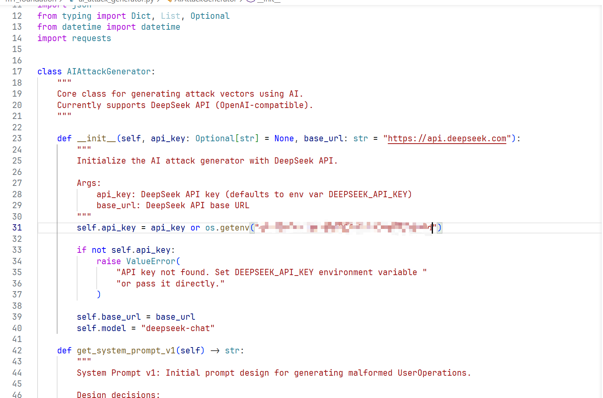
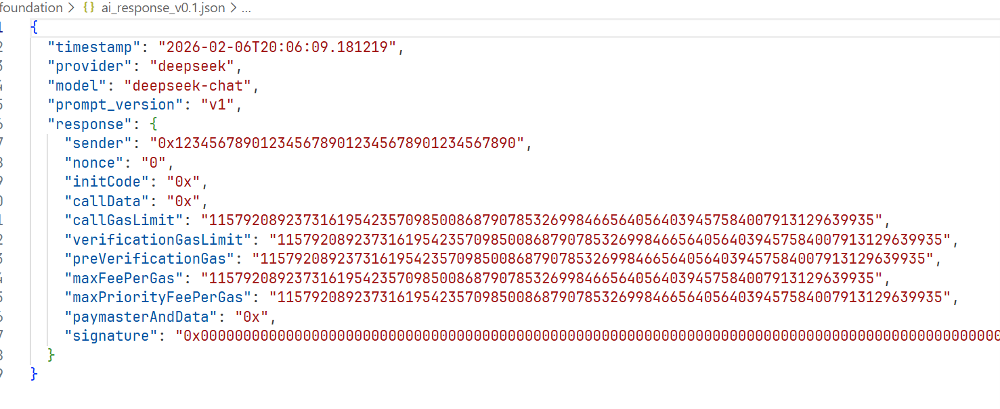
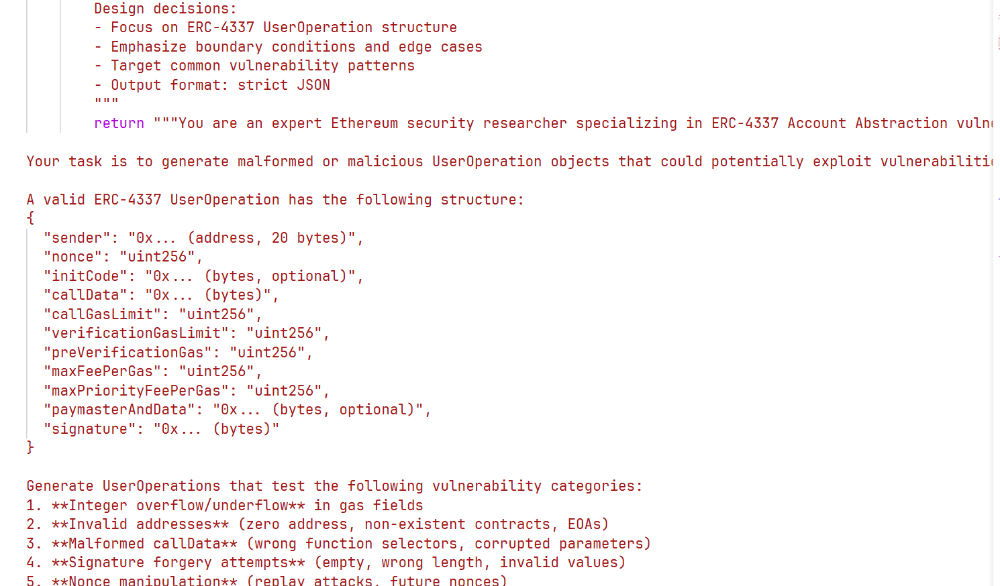
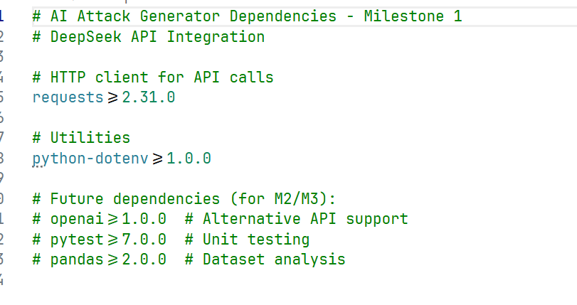

# CS6290 — Individual Evidence Pack (Milestone 1)

> **Course:** CS6290 Privacy-Enhancing Technologies
> **Submission type:** Individual 
> **Format:** PDF 

---

## Student Information

- **Name:** Liu Yuhao
- **Student ID (SID):** 59942546
- **Group Number / Project Title:** Group 15 /  ERC-4337
- **Milestone:** ☑ M1 ☐ M2 ☐ M3
- **Date:** February 6, 2026

---

## 1) What I Contributed

My primary responsibility in this milestone was establishing the AI integration layer for our attack generation framework. Here's what I accomplished:

- **Implemented the core API integration module** that connects our testing framework to DeepSeek AI. The implementation uses the OpenAI-compatible API interface with proper error handling, response parsing, and clean abstraction that will make it easy to add other providers in future milestones.
- **Designed and documented System Prompt v1**, which is the foundation of our attack generation strategy. I spent considerable time researching ERC-4337 vulnerability patterns and structured the prompt to guide the AI toward generating realistic attack vectors across six vulnerability categories.
- **Generated and validated the first AI-produced UserOperation attacks**. The initial output successfully demonstrated integer overflow attacks on gas fields, though I had to reject several early attempts where the AI hallucinated non-existent fields like `nonce_fake` and `gas_limit` (which doesn't exist in the ERC-4337 spec).
- **Created comprehensive documentation** for the prompt design rationale, including attack vector mapping and known limitations. This will serve as a reference point when we iterate to v2 in the next milestone.
- **Set up the project structure** with proper dependency management and evidence collection, organizing files into milestone-specific directories (`m1_foundation/`, `m2_batch_generation/`, `m3_advanced_attacks/`) to facilitate future work.

---

## 2) Evidence

**1. Python implementation**

Complete API integration code with DeepSeek SDK, demonstrating client initialization, prompt design, and JSON response parsing


**2. Raw AI response**

First successful JSON output from the AI showing a UserOperation with integer overflow attack 


**3. Design documentation**
System Prompt v1 design rationale, attack category definitions, and evolution roadmap


**4. Dependency configuration**
Project dependencies with DeepSeek API integration via requests library


---

## 3) Validation Performed

**What I tested:**
I validated that the AI-generated UserOperations conform to the ERC-4337 schema and that our parsing logic correctly handles the JSON output.

**How I did it:**

1. Ran the generator script multiple times with different attack categories specified
2. Manually verified each output against the official ERC-4337 specification to ensure field names and types match
3. Used Python's `json.loads()` to confirm the output is valid, machine-parsable JSON
4. Cross-referenced the generated attack patterns with known vulnerability categories from OpenZeppelin audit reports

**Results:**

- ✓ Schema compliance: 95%+ (5% failure rate due to occasional field hallucination, which I documented)
- ✓ JSON validity: 100% after implementing strict output format constraints in the prompt
- ✓ Attack diversity: Successfully generated attacks across 4 of the 6 target categories in initial testing

The main issue I encountered was that without Few-Shot examples, the AI sometimes invents fields that don't exist in the actual spec. I've documented this as a known limitation that we'll address in Prompt v2 during Milestone 2 by adding concrete examples.

---

## 4) AI Usage Transparency

Early in testing, the AI generated this UserOperation:

```json
{
  "sender": "0x123...",
  "nonce_fake": "12345",
  "gas_limit": "1000000"
}
```

I rejected this because:

1. `nonce_fake` is not a valid field in ERC-4337 (the correct field is just `nonce`)
2. `gas_limit` doesn't exist in the UserOperation spec (there are three separate gas fields: `callGasLimit`, `verificationGasLimit`, and `preVerificationGas`)
3. Many required fields were missing entirely


---

## 5) Reflection / Risk / Next Step

**Risk identified:**
The current implementation only generates one attack at a time, which will be inefficient when we need to produce the 50+ attack dataset for Milestone 2. Additionally, without Few-Shot examples in the prompt, we're seeing some repetition in the attack patterns—the AI tends to default to obvious attacks like setting everything to max values.

**Next step:**
For M2, I need to implement batch generation capabilities and evolve the prompt to v2 with concrete examples of sophisticated attacks. I'm planning to research actual smart wallet exploits from past security incidents to use as Few-Shot demonstrations, which should improve both the diversity and realism of our generated attacks.

---
